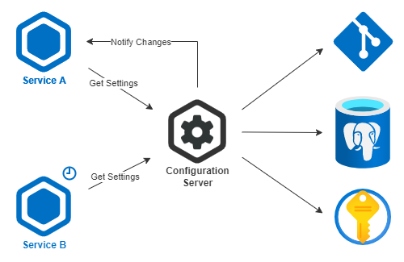

## Configuration Server

## Give a Star! :star:

If you liked my work and want to support me, please give it a star. Thanks!

## How to Run
```
docker-compose up -d
```

### Endpoint
```
http://localhost:8888/configserver/dev/main
```

## 1. Introduction

This is a Configurations Microservice to serve application settings, on a microservice environment, in a centralized way.

### 1.1 Problems
- Many apps have his settings on configuration files or hardcoded
- These settings are separated between environments. Ex: Dev, QA, Prod
- If a configuration change you must update, build, and redeploy the app(s)
- Complexity to deal with configurations from multiple sources. Ex: configuration files and database stored settings

### 1.2 Proposed Solution
- A centralized way where each app could request his configurations at startup
- A way to update configurations while running. Ex: Changes Notification, Cron Update
- A merge operation between multiple configuration data sources
  - Git repositories files
  - Vaults
  - Databases
  - Storages

## 2. Architecture


<br>

## 3. Implementation Details

### 3.1 Spring Cloud Config
The project is a **Spring Cloud Config** app using his dependencies. But is important to explain that client-side is not coupled to Spring, or even JVM Environment. There is clients packages for languages like C#, Python, Node and so on.

### 3.2 Overview
- The Application works with an `{application}/{label}/{profile}` pattern
- The returned value is translated on client using packages

### 3.3 Git Repositories
- At this level, profile are being used as branch
- So you can have settings per branch. Ex: Dev, QA, Prod
- For simplicity, I'm using a public repository, but authentication could be used
- You can work with multiple git providers like GitHub, GitLab, Azure Devops, etc

### 3.4 Database Repositories
- At this level, the easy way to work is to follow a database structure
- You should follow a table schema specified at `sql` folder in `init.sql` file
- Otherwise, you could override the `findOne` method at `DatabaseRepository` class
- Or change `spring.cloud.config.server.jdbc.sql` on `application.properties`

## 4. Containers
The application is containerized using **Docker** and automated using **Docker Compose**.

## 5. Packages and Frameworks
- [Gradle](https://gradle.org/) - Build Management
- [Spring Cloud Config](https://spring.io/projects/spring-cloud-config) - Project Base Technology
- [Docker](https://docs.docker.com/) - Container Management
- [Docker Compose](https://docs.docker.com/compose/) - Multi-Container Management
- [Sql Server Connection](https://github.com/microsoft/mssql-jdbc) - Database Connectivity
- [Spring Data JDBC](https://spring.io/projects/spring-data-jdbc) - Database Abstraction
